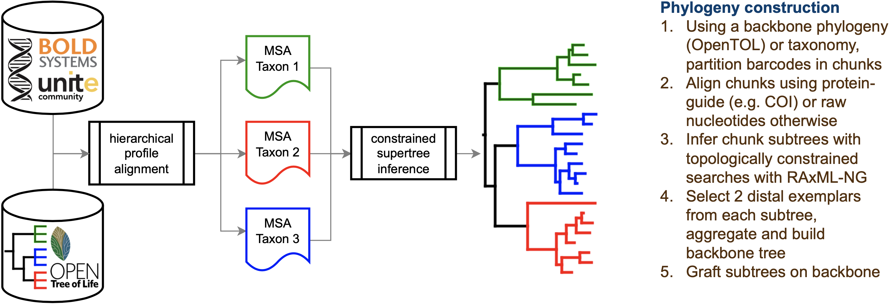
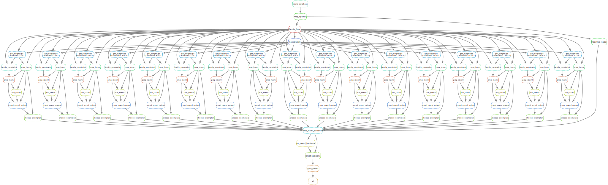

# Bactria: BarCode TRee Inference and Analysis
This repository contains code and data for building very large, topologically-constrained 
barcode phylogenies through a divide-and-conquer strategy. Such trees are useful as 
reference materials in the comparable calculation of alpha and beta biodiversity metrics 
across metabarcoding assays. The input data for the approach we develop here comes from 
BOLD. The international database [BOLD Systems](https://www.boldsystems.org/index.php) 
contains DNA barcodes for hundreds of thousands of species, with multiple barcodes per 
species. Theoretically, this data could be filtered and aligned per DNA marker to make 
phylogenetic trees. However, there are two limiting factors: building very large 
phylogenies is computationally intensive, and barcodes are not considered ideal for 
building big trees because they are short (providing insufficient signal to resolve large 
trees) and because they tend to saturate across large patristic distances.



Both problems can be mitigated by using the 
[Open Tree of Life](https://tree.opentreeoflife.org/opentree/argus/opentree13.4@ott93302) 
as a further source of phylogenetic signal. The BOLD data can be split into chunks that 
correspond to Open Tree of Life clades. These chunks can be made into alignments and 
subtrees. The OpenTOL can be used as a constraint in the algorithms to make these. The 
chunks are then combined in a large synthesis by grafting them on a backbone made from 
exemplar taxa from the subtrees. Here too, the OpenTOL is a source of phylogenetic 
constraint.

In this repository this concept is prototyped for both animal species and plant species.

## Installation

The pipeline and its dependencies are managed using conda. On a linux or osx system, you 
can follow these steps to set up the `bactria` Conda environment using an `environment.yml` 
file and a `requirements.txt` file:

1. **Clone the Repository:**  
   Clone the repository containing the environment files to your local machine:
   ```bash
   git clone https://github.com/naturalis/barcode-constrained-phylogeny.git
   cd barcode-constrained-phylogeny
   ```
2. **Create the Conda Environment:**
   Create the bactria Conda environment using the environment.yml file with the following 
   command:
   ```bash
   conda env create -f workflow/envs/environment.yml
   ```
   This command will create a new Conda environment named bactria with the packages 
   specified in the environment.yml file. This file also includes pip packages specified in 
   the workflow/envs/requirements.txt file, which will be installed after the Conda packages.
3. **Activate the Environment:**
   After creating the environment, activate it using the conda activate command:
   ```bash
   conda activate bactria
   ```
4. **Verify the Environment:**
   Verify that the bactria environment was set up correctly and that all packages were 
   installed using the conda list command:
   ```bash
   conda list
   ```
   This command will list all packages installed in the active conda environment. You should 
   see all the packages specified in the environment.yml file and the requirements.txt file.

## How to run

The pipeline is being implemented using snakemake, which is available within the conda 
environment that results from the installation. Important before running the snakemake pipeline 
is to change in [config/config.yaml](config/config.yaml) the number of threads available on your 
computer. Which marker gene is used in the pipeline is also specified in the config.yaml (default 
COI-5P). Prior to execution, the BOLD data package to use (we used the 
[release of 30 December 2022](https://www.boldsystems.org/index.php/datapackage?id=BOLD_Public.30-Dec-2022)) 
must be downloaded manually and stored in the [resources/](resources/) directory. If a BOLD release 
from another date is used the file names in config.yaml need to be updated. 

From the barcode-constrained-phylogeny directory move into directory where the snakefile is 
located:
```bash 
cd workflow/
```

How to run the pipeline for all family alignments:
```bash 
snakemake -R all --snakefile Snakefile -j {number of threads}
```

Snakemake rules can be performed separately:
```bash 
snakemake -R {Rule} --snakefile Snakefile -j {number of threads}
```

Enter the same number at {number of threads} as you filled in previously in src/config.yaml.
In {Rule} insert the rule to be performed.

Here is an overview of all the rules in the snakefile_phylogeny:



## Repository layout

Below is the top-level layout of the repository. This layout is in line with 
[community standards](https://snakemake.readthedocs.io/en/stable/snakefiles/deployment.html) and must be adhered to.
All of these subfolders contains further explanatory READMEs to explain their contents in more detail.

- [config](config/) - configuration files
- [doc](doc/) - documentation and background literature
- [resources](resources/) - external data resources (from BOLD and OpenTree) are downloaded here
- [results](results/) - intermediate and final results are generated here
- [workflow](workflow/) - script source code and driver snakefile 

## License

MIT License

Copyright (c) 2023 Naturalis Biodiversity Center

Permission is hereby granted, free of charge, to any person obtaining a copy
of this software and associated documentation files (the "Software"), to deal
in the Software without restriction, including without limitation the rights
to use, copy, modify, merge, publish, distribute, sublicense, and/or sell
copies of the Software, and to permit persons to whom the Software is
furnished to do so, subject to the following conditions:

The above copyright notice and this permission notice shall be included in all
copies or substantial portions of the Software.

THE SOFTWARE IS PROVIDED "AS IS", WITHOUT WARRANTY OF ANY KIND, EXPRESS OR
IMPLIED, INCLUDING BUT NOT LIMITED TO THE WARRANTIES OF MERCHANTABILITY,
FITNESS FOR A PARTICULAR PURPOSE AND NONINFRINGEMENT. IN NO EVENT SHALL THE
AUTHORS OR COPYRIGHT HOLDERS BE LIABLE FOR ANY CLAIM, DAMAGES OR OTHER
LIABILITY, WHETHER IN AN ACTION OF CONTRACT, TORT OR OTHERWISE, ARISING FROM,
OUT OF OR IN CONNECTION WITH THE SOFTWARE OR THE USE OR OTHER DEALINGS IN THE
SOFTWARE.
